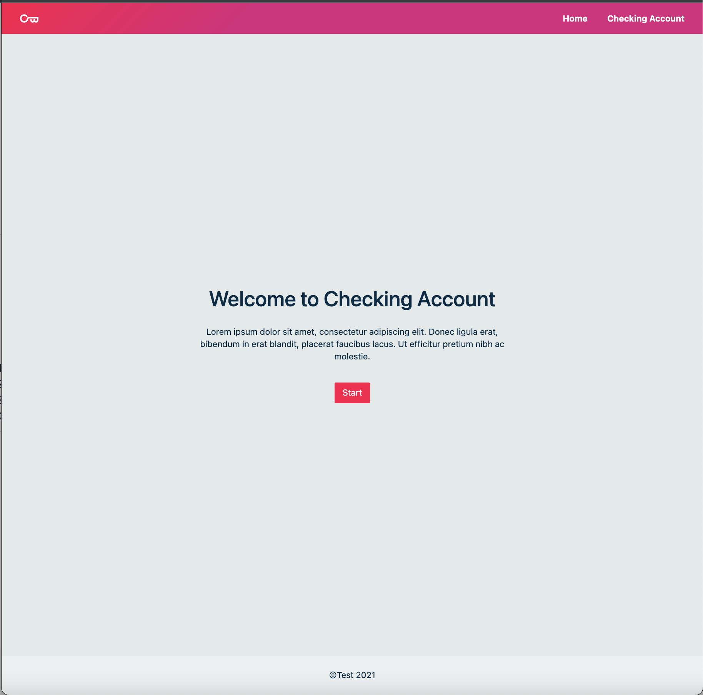
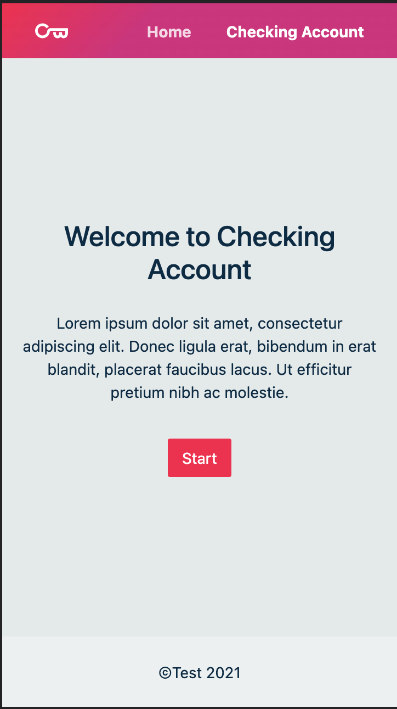
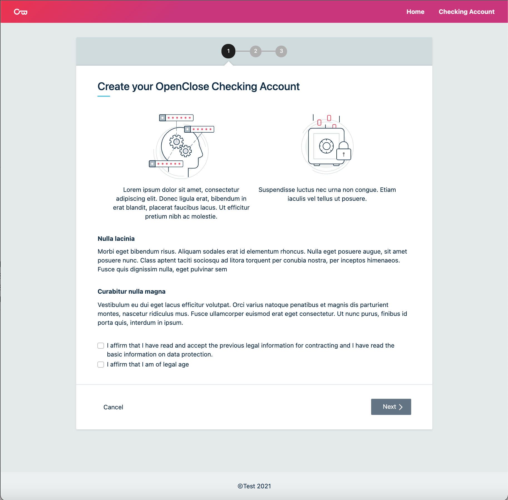
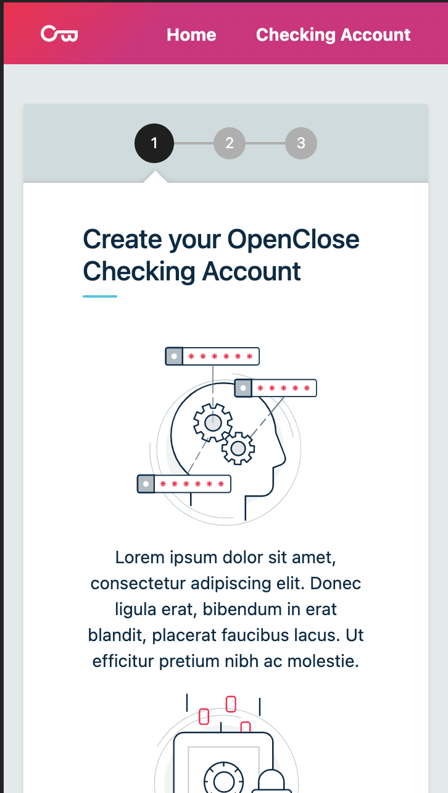
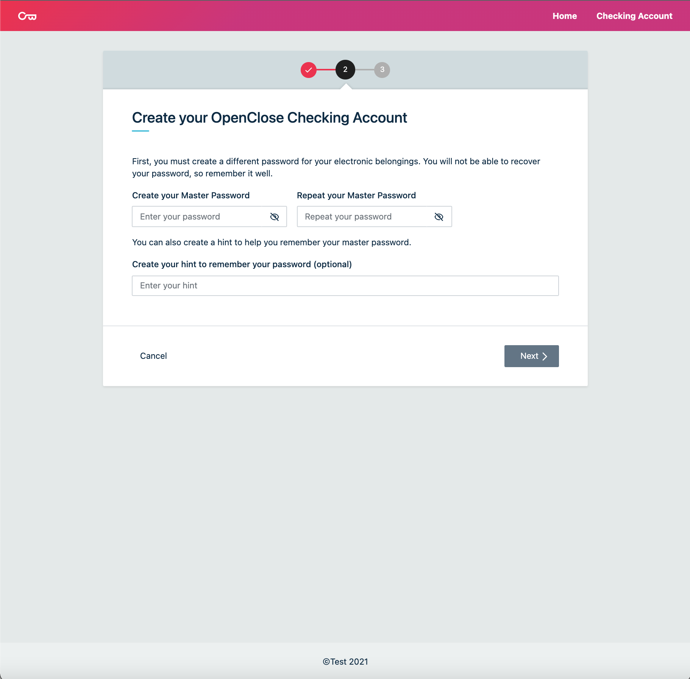
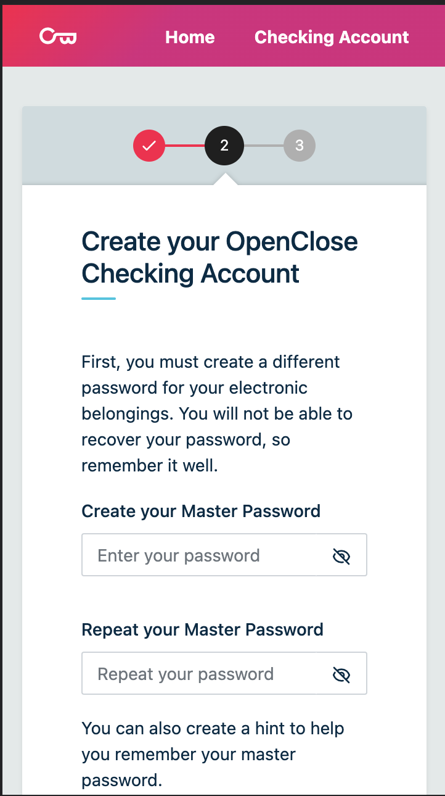
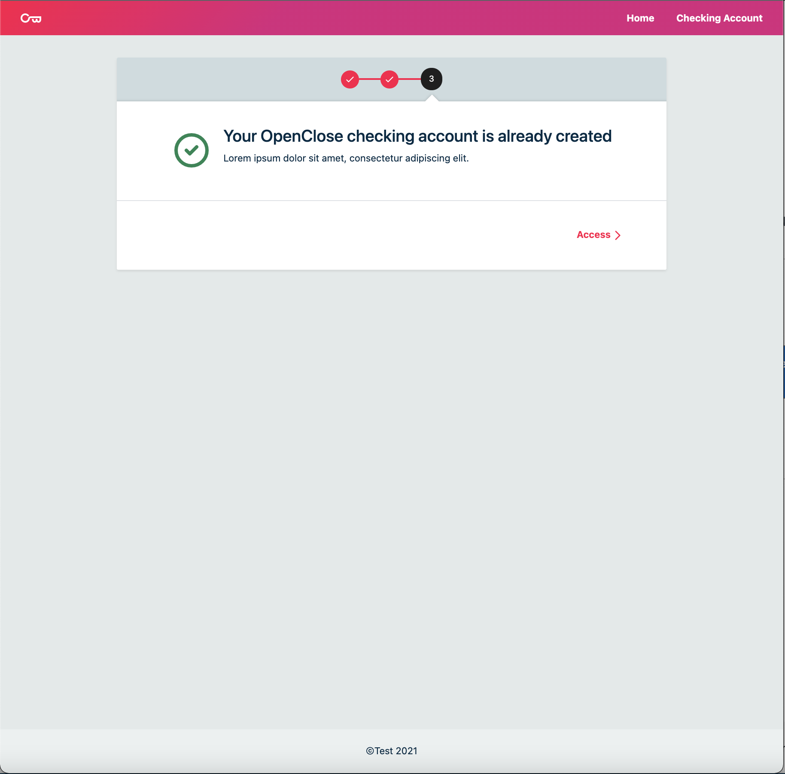
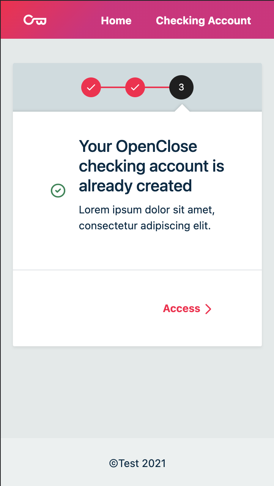

# Wizard test app

Code test for Web. With **Typecript**, **Redux**, **Sagas**, **Redux-Toolkit**, **react-hook-form** and **react-router-dom** as core technologies for ReactJS

This project was bootstrapped with Create React App. For more information see the [next section](./more_info/CREATE_REACT_APP.md)

| web                                                                                 | response                                                                                |
| ----------------------------------------------------------------------------------- | --------------------------------------------------------------------------------------- |
|    |    |
|  |  |
|  |  |
|  |  |

---

## Project Info

> - ReactJS
> - Sass
> - Typescript
> - Pattern
> - Redux, sagas, redux-toolkit, Jest
> - other libs and helpers

for more information see: [archivo.md](./more_info/archivo.md)

---

## Installation prerequisites

- The latest LTS version of [NodeJS](https://nodejs.org/es/) must be installed
- NodeJS package [yarn](https://yarnpkg.com/) must be installed.

Install dependencies:

```
$ yarn
```

to start the app, execute

```
$ yarn start

```

to start the test, execute

```
$ yarn test

```

The rest of the scripts can be seen in `package.json` that are destined for development
